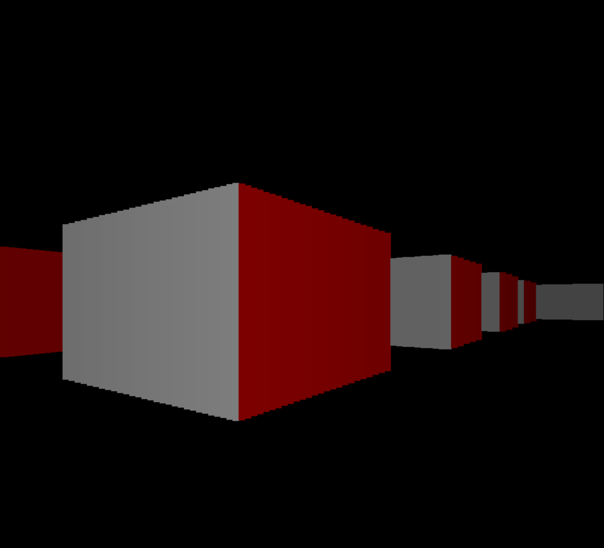
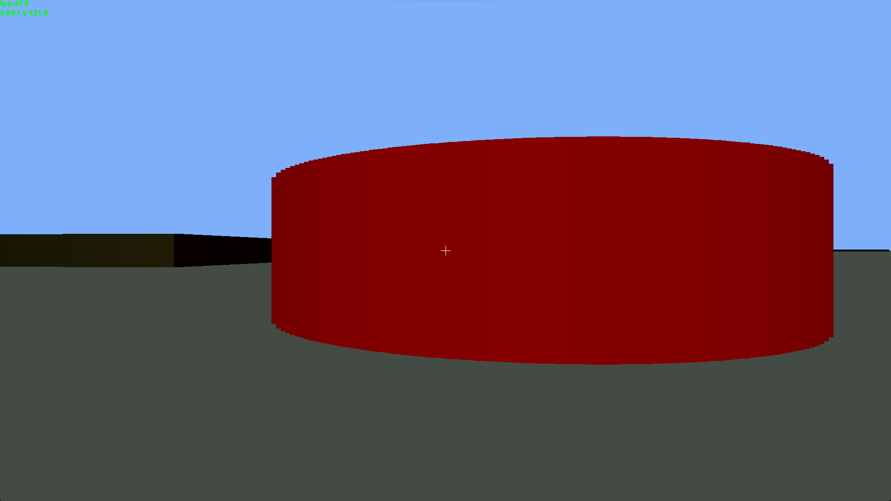
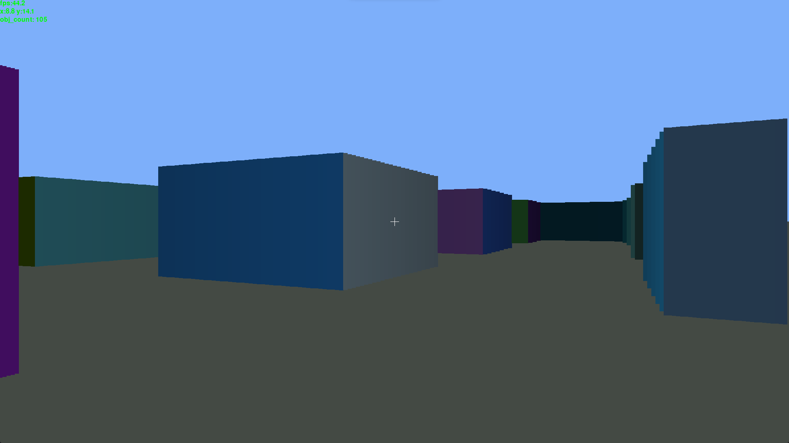

# PyCaster [WIP]

_Welcome to my little hobby corner of the Internet!_

I've been interested in rendering engines and physics simulations for quite some time now, and I wanted to sit down and give it a go my self. This project is something I have been slowly working on for the past year, and is an outlet for me to experiment with the thought processes required in designing one's own game engine. 

I originally started this project in Java, but decided that It would be better to prototype the idea in python with pygame, and then move to Java (or hopefully C some day) once the general concepts and overall structure is down. 

Now with introductions out of the way, lets get into the project!

## A Ray Caster?!...

Most ray casters you'll find online use a grid based system, where the world is separated into cells which can be occupied by different states (a wall with a brick texture, a wall with a metal textue, a door, etc.). This is a really effective and efficient approach, but it does limit flexability in world geometry. That's where this ray caster differs; Instead of using a cell/grid based system, it uses a dynamic system. This allows for the rendering of nearly any two-dimensional shape.

That is not to say that this has never been done before (As it most certainly has). Instead, this is just meant to be a fun challenge/project to occupy myself in my last few semesters of college.

## Screenshots

TODOs:
- [x] Add another world object type
- [x] Lay groundwork for texture mapping
- [x] Add rudimentary player collision for world objects
- [x] De-link world coordinate system from window dimensions
- [x] Formalize a wolrd objects data structure for future additions
- [x] Reformat engine and game initialization to better support OOP principles
- [ ] Add a GUI module for implementation of a start menu and pause menu
- [ ] Investigate migrating mouse button input to engine.process_mouse_buttons()
- [ ] Add config for variable graphics modules (maybe class that handles controls depending on module)
- [ ] Use the buffer swap principle for movement updates
- [ ] Investigate the use of a decorator for the player collision check
- [ ] Need to make mouse movement smooth
- [ ] Allow player to slide along wall (do some trig stuff I guess)

Large Goals:
- [x] Add a legitimate ReadMe!
- [x] Add better documentation (Seriously, document your code)
- [ ] Optimize calculations by dynamically selecting walls/rays
- [ ] Add textures
- [ ] Add menu system
- [ ] Add loading and saving of world states
- [ ] Add entities
- [ ] Add more propper floors/ceilings
- [ ] Switch to a more efficient graphics module
- [ ] Create a world editor

