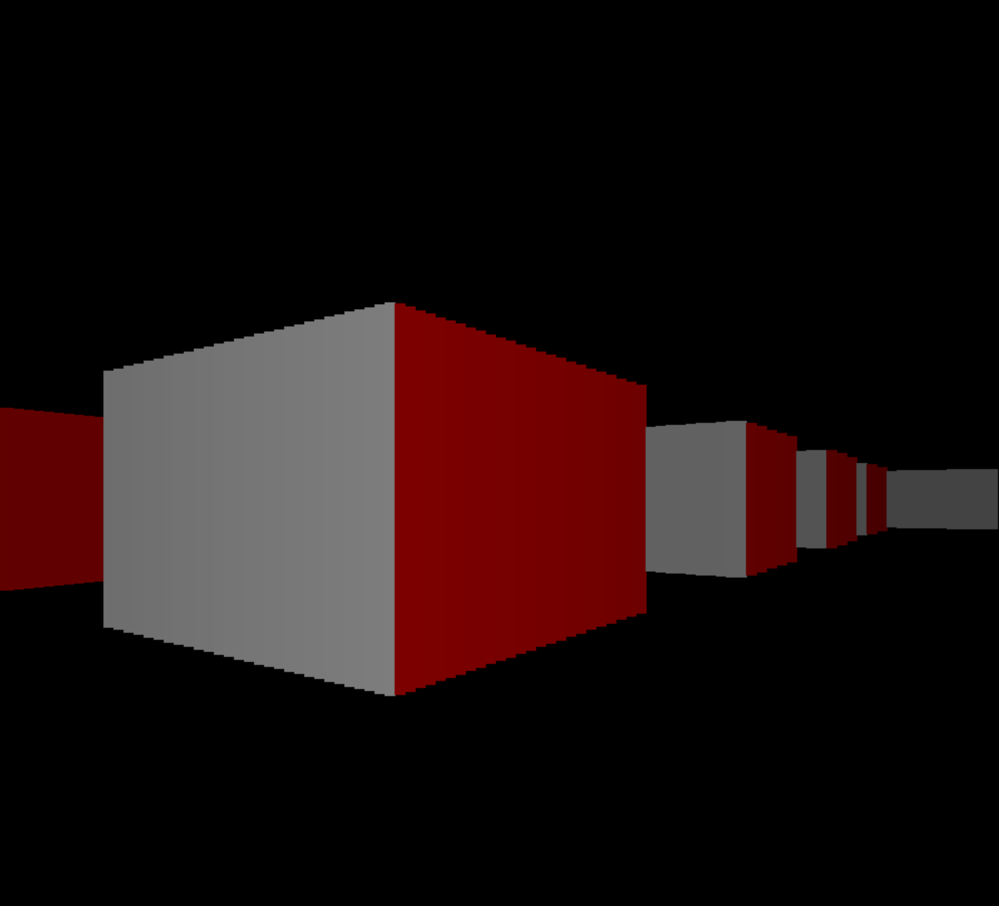

# PyCaster [WIP]

_Welcome to my little hobby corner of the Internet!_

I've been interested in rendering engines and physics simulations for quite some time now, and I wanted to sit down and give it a go my self. This project is something I have been working for the past few months, and is an outlet for me to experiment with the thought processes required in designing one's own game engine. 

I originally started this project in Java, but decided that It would be better to prototype the idea in python with pygame, and then move to Java (or hopefully C some day) once the general concepts and overall structure is down. 

Now with introductions out of the way, lets get into the project!

## A Ray Caster? We've Seen This Before...

Most ray casters you'll find online use a grid based system, where the world is separated into cells which can be occupied by different states (a wall with a brick texture, a wall with a metal textue, a door, etc.). This has prooved to be an effective and efficient way of While this is great for demonstrations and when computers only had 5 Mbs of memory, It does limit flexability in world geometry. That's where this ray caster differs; Instead of using a cell/grid based system, it uses a dynamic system. This allows for the rendering of nearly any two-dimensional shape.

That is not to say that this has never been done before (As it most certainly has). Instead, this is just meant to be a fun challenge/project to occupy myself in my last few semesters of college.

Tasks:
- [x] Add a legitimate ReadMe!
- [ ] Add better documentation (Seriously dude, document your code)
- [x] Unbind world space from screen space
- [ ] Separate builds into different branches
- [ ] Optimize calculations by dynamically selecting walls/rays
- [ ] Add textures
- [ ] Add loading and saving of world states
- [ ] Add entities
- [ ] Add more propper floors/ceilings
- [ ] Create a world editor
- [ ] Create a port in a more efficient language

## Screenshots

